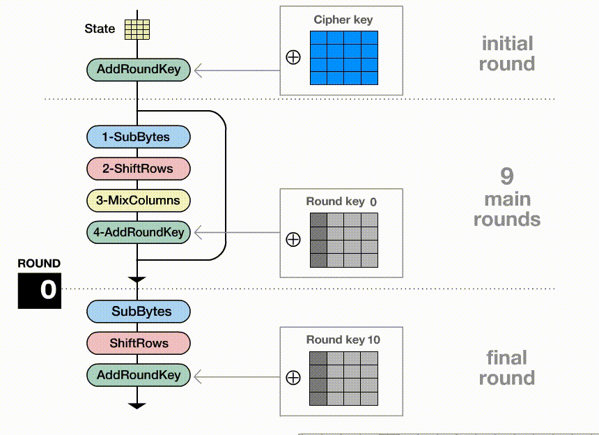
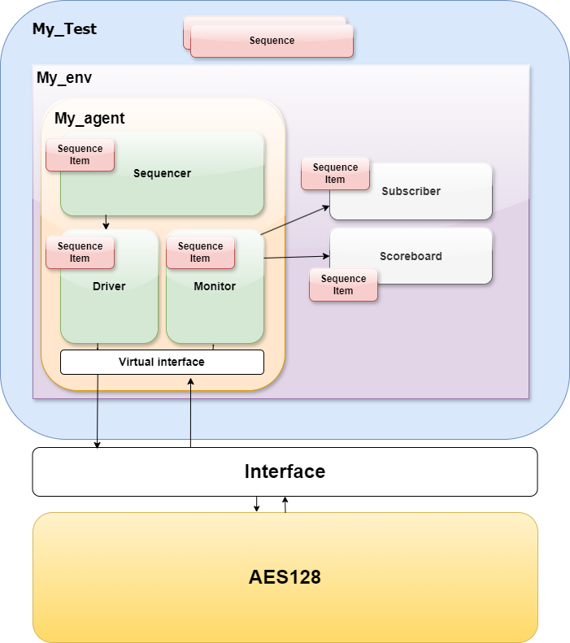
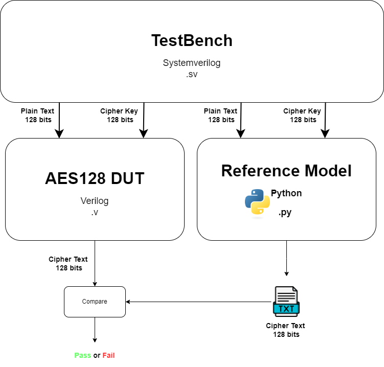

# UVM Verification Environment for AES128
>AES (Advanced Encryption Standard) is a symmetric encryption algorithm widely used for securing data. AES128 refers specifically to the 128-bit key version of AES.

# 🔐 What is Aes128?
#### AES-128 is a specific variant of the Advanced Encryption Standard (AES) that uses a 128-bit key for encryption and decryption. AES is a symmetric encryption algorithm, meaning the same key is used for both encrypting and decrypting data.

   

 - **Key Size:**
128-bit Key: AES-128 uses a key that is `128 bits` long `(16 bytes)`. It is one of the three key sizes supported by AES, with the others being 192 bits and 256 bits (AES-192 and AES-256).
   
 - **Block Size:**
AES encrypts and decrypts data in fixed-size blocks of 128 bits (16 bytes), regardless of the key size.

 - **Rounds:**
AES-128 performs `10 rounds` of processing on each block of data. These rounds involve several operations such as substitution, permutation, mixing, and key addition.

# 🔒 AES-128 Encryption Process
AES-128 involves the following steps for encryption:

   

**1- Key Expansion:**
The 128-bit key is expanded into an array of key schedule words.

**2- Initial Round:**
  - **AddRoundKey:** Each byte of the data block is XORed with the round key derived from the key schedule.

**3- Main Rounds (9 Rounds):**
   - **SubBytes:** Each byte in the block is substituted with a corresponding byte from a substitution table (S-box).
  
   - **ShiftRows:** Rows of the data block are cyclically shifted to the left.

   - **MixColumns:** Columns of the data block are mixed to provide diffusion.

   - **AddRoundKey:** Each byte is XORed with a round key derived from the key schedule.

**4- Final Round:**
  - **SubBytes**

  - **ShiftRows**

  - **AddRoundKey**

# 💡 Verification Environment
The environment includes sequence items, sequences, drivers, monitors, and other UVM components necessary for a complete verification setup.

   

**`💠Enc_Sequence_Item:`** This class represents a sequence item for encryption. It includes randomizable fields for the `Message` and `Key`, as well as a `ciphertext` field for the encrypted output.

**`💠Enc_Sequence:`** Generates a sequence of `Enc_Sequence_Item` objects. It randomizes it in the body task, repeating the process 16 times.

**`💠Enc_Driver:`** Drives the `Enc_Sequence_Item` to the design under test (DUT).

     //It writes these values to a text file so that the python refrence model can access the same data to the dut.
    file = $fopen("verilogoutput.txt", "w");
    $fdisplay(file, "Message:%h Key:%h", seq_item.Message, seq_item.Key);
    $fclose(file);
**`💠Enc_Monitor:`** Monitors the DUT outputs, captures the ciphertext, and writes it to an analysis_port for further analysis. It continuously reads the ciphertext from the DUT and updates the sequence item.

**`💠Enc_ScoreBoard:`** Compares the ciphertext from the DUT against an expected value. It reads the expected value from The python Refrence Model and displays whether the test passed or failed

  		file = $fopen("PythonOutput.txt", "r");
  		$system("C:/Users/ziada/OneDrive/Desktop/VerificationCourse/EncryptorUVM/UVM_AES128/dist/main.exe");
  		$fclose(file);
  		file = $fopen("PythonOutput.txt", "r");
  		$fscanf(file, "%h", out);
  		$display("Refrence Model Output: 0x%h DUT Output: 0x%h", out, t.ciphertext);
  		$fclose(file);
  		if(out == t.ciphertext) $display("Test Passed");
  		else $display("Test fail");

# ⚙️ Operation Diagram    

   

# 🔑 Python Refrence Model
- Read the text file which contains the plain text and the key which was generated from the systemverilog code
    
      file_verilog_output = open('put text file path', 'r')
      content = file_verilog_output.readline()
      search_string_message = "Message:"
      search_string_key = "Key:"
      Message = []
      Key     = []

- Decoding criteria to write find the text and key in the text file
    
      # Find the index of the search_string
      index_message = content.find(search_string_message)
      index_key     = content.find(search_string_key)
      
      if index_message != -1:  # Check if search_string was found
          result_m = content[index_message + len(search_string_message):].strip()  # Get the string after the search_string
          Message = result_m[:32]
      
      
      if index_key != -1:  # Check if search_string was found
          result_K = content[index_key + len(search_string_key):].strip()  # Get the string after the search_string
          Key = result_K[:32]

- Encrypting the text using the cipher key and writing the output to a text file for the systemverilog Comparison
    
      obj = AES.new(Key, AES.MODE_ECB)
      ciphertext = obj.encrypt(Message)
      
      with open('C:/Users/ziada/OneDrive/Desktop/VerificationCourse/EncryptorUVM/PythonOutput.txt', 'w') as file:
          file.write(ciphertext.hex())

  
        

